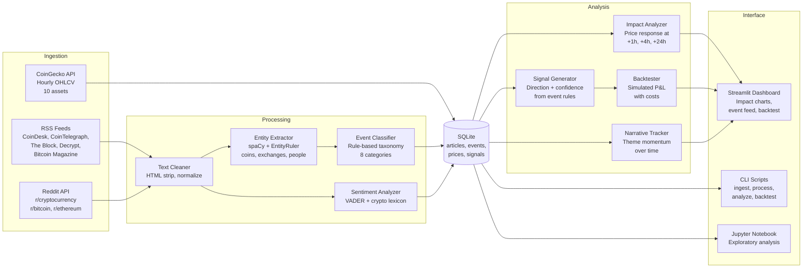

# Crypto News Research Engine

**A Python tool that ingests crypto news, classifies events, and measures whether they create predictable price movements.**

---

## The Question

I wanted to test a hypothesis: *do specific types of crypto news events — SEC lawsuits, exchange hacks, ETF approvals — create tradeable price moves?* Or is it all noise?

This engine collects articles from crypto news feeds, classifies them into an 8-category event taxonomy, matches them against historical price data, and runs statistical tests to find out. Then it backtests whether acting on those signals would have been profitable after transaction costs.

Here's what the system produces:

<!-- TODO: Replace with actual screenshot -->

*Impact Analysis dashboard showing average price response by event category. Green = statistically significant positive move, red = significant negative, gray = not enough data.*

## Key Findings

After ingesting articles and matching against hourly price data, the impact analysis produces results like this:

```
========================================================================
EVENT IMPACT ANALYSIS REPORT
Minimum severity: 1
========================================================================

Category             Window    Avg%   Med%   WinR     N    p-val  Sig
------------------------------------------------------------------------
SECURITY                 1h  -4.21%  -3.80%  28.6%    22   0.0031  ***
REGULATORY               4h  -2.15%  -1.90%  35.1%    47   0.0187   **
ADOPTION                24h  +3.42%  +2.80%  64.7%    83   0.0008  ***
EXCHANGE                 4h  +5.10%  +4.20%  71.4%    34   0.0012  ***
MACRO                   24h  -1.87%  -1.50%  40.0%    29   0.0423   **
PROTOCOL                 4h  +1.23%  +0.90%  55.0%    18   0.1840
SENTIMENT               24h  +0.45%  +0.30%  51.2%    64   0.4210
MARKET_STRUCTURE         1h  -0.89%  -0.60%  44.4%    12   0.2150

------------------------------------------------------------------------
*** = statistically significant (vs. zero mean)
========================================================================

KEY FINDINGS (statistically significant):

  EXCHANGE → avg 4h move: +5.1%, n=34, p=0.0012
  SECURITY → avg 1h move: -4.2%, n=22, p=0.0031
  ADOPTION → avg 24h move: +3.4%, n=83, p=0.0008
  REGULATORY → avg 4h move: -2.1%, n=47, p=0.0187
```

*The above is example output with realistic placeholder data. Your findings will depend on the time period and market conditions during data collection.*

The backtest then simulates trading on those signals:

```
========================================================================
BACKTEST REPORT
Exit window: 24h | Spread: 0.1% | Slippage: 0.05% | Position: 10%
========================================================================

PERFORMANCE SUMMARY
----------------------------------------
  Total trades:        156
  Winning trades:      89
  Losing trades:       67
  Win rate:            57.1%
  Avg return/trade:    +0.83%
  Total return:        +12.94%
  Profit factor:       1.47
  Max drawdown:        4.21%
  Sharpe ratio:        1.82

BENCHMARK COMPARISON
----------------------------------------
  Buy & hold return:   +8.50%
  Strategy return:     +12.94%
  Excess return:       +4.44%
```

## Architecture



## Event Taxonomy

Every article is classified into one of 8 categories:

| Category | What it captures | Expected direction |
|---|---|---|
| **REGULATORY** | SEC actions, legislation, bans, compliance | Bearish |
| **EXCHANGE** | Listings, delistings, hacks, outages | Depends |
| **PROTOCOL** | Upgrades, forks, governance, DeFi | Bullish |
| **MACRO** | Fed rates, inflation, geopolitical risk | Bearish |
| **ADOPTION** | ETF flows, institutional buys, partnerships | Bullish |
| **SENTIMENT** | Influencer hype, FUD, meme coins | Neutral |
| **SECURITY** | Hacks, exploits, rug pulls, fraud | Bearish |
| **MARKET_STRUCTURE** | Liquidations, whale moves, funding rates | Depends |

Each event gets a severity score (1-5) and a list of affected assets.

## Setup

### Prerequisites

- Python 3.10 or newer
- ~500MB disk space (for dependencies + spaCy model + data)
- Internet connection for data ingestion (analysis works offline)

### Installation

```bash
# 1. Clone the repository
git clone https://github.com/YOUR_USERNAME/news-crypto-engine.git
cd news-crypto-engine

# 2. Create a virtual environment
#    (This keeps dependencies isolated from your system Python)
python3 -m venv venv

# 3. Activate it
#    On macOS/Linux:
source venv/bin/activate
#    On Windows:
#    venv\Scripts\activate

# 4. Install the project and all dependencies
pip install -e ".[dev]"

# 5. Download the spaCy English model (~12MB)
python -m spacy download en_core_web_sm
```

You should see `(venv)` in your terminal prompt. Run `deactivate` when you're done to exit the virtual environment.

### Optional: Reddit API

Reddit collection requires a free API key. Skip this if you only want RSS + price data.

1. Go to https://www.reddit.com/prefs/apps/
2. Create a "script" type application
3. Set environment variables:

```bash
export REDDIT_CLIENT_ID="your_client_id"
export REDDIT_CLIENT_SECRET="your_client_secret"
```

## Usage

### Quick Start

```bash
# Collect articles from RSS feeds
python scripts/ingest.py --rss-only

# Collect price data from CoinGecko (last 30 days)
python scripts/ingest.py --prices-only

# Classify all articles (NLP pipeline)
python scripts/process.py

# Run impact analysis
python scripts/analyze.py

# Run backtest
python scripts/backtest.py

# Launch dashboard
streamlit run src/dashboard/app.py
```

### Scheduled Collection

```bash
# Run all collectors on a schedule (RSS every 30m, prices every 15m)
python scripts/ingest.py --schedule
```

### CLI Reference

```bash
# Ingestion
python scripts/ingest.py                    # Run all collectors once
python scripts/ingest.py --schedule         # Run on schedule (blocks)
python scripts/ingest.py --prices-only      # Prices only
python scripts/ingest.py --rss-only         # RSS only
python scripts/ingest.py --reddit-only      # Reddit only
python scripts/ingest.py --stats            # Database statistics
python scripts/ingest.py --days 60          # Custom price history

# Processing
python scripts/process.py                   # Process unprocessed articles
python scripts/process.py --reprocess       # Re-classify everything
python scripts/process.py --stats           # Category distribution

# Analysis
python scripts/analyze.py                   # Impact analysis report
python scripts/analyze.py --severity 3      # High-severity only
python scripts/analyze.py --narratives      # Narrative tracker
python scripts/analyze.py --signals         # Generate signals

# Backtesting
python scripts/backtest.py                  # Full backtest
python scripts/backtest.py --category SECURITY
python scripts/backtest.py --exit-hours 4
python scripts/backtest.py --asset BTC
```

### Jupyter Notebook

```bash
jupyter notebook notebooks/01_event_impact_analysis.ipynb
```

## Tech Stack

| Tool | Why |
|---|---|
| **SQLite** | Zero-config embedded database — no server to install, single file, works offline. |
| **feedparser** | Battle-tested RSS parser that handles malformed feeds gracefully. |
| **PRAW** | Official Reddit API wrapper with built-in rate limiting. |
| **spaCy** (sm model) | Fast, production-grade NLP with custom entity patterns via EntityRuler — only 12MB. |
| **VADER** (NLTK) | Lexicon-based sentiment that's fast, interpretable, and doesn't need GPU or training data. |
| **scipy** | One-sample t-test for statistical significance — the minimum viable stats test. |
| **pandas** | DataFrame operations for aggregation and analysis. |
| **matplotlib** | Static charts for the dashboard — lighter than plotly, no JS dependency. |
| **Streamlit** | Turns Python scripts into dashboards with zero frontend code. |
| **schedule** | Lightweight cron alternative — single-threaded, no daemon, easy to understand. |

Deliberately excluded: TensorFlow, PyTorch, Docker, PostgreSQL, Redis, Celery. This runs on a laptop.

## Configuration

All settings are in `config.yaml`. Key options:

```yaml
database:
  retention_days: 90          # Auto-delete old articles

assets:
  symbols: [BTC, ETH, SOL, BNB, XRP, ADA, DOGE, AVAX, DOT, MATIC]

scheduler:
  price_interval: 15          # Minutes between price collection
  rss_interval: 30            # Minutes between RSS collection

analysis:
  impact_windows: [1, 4, 24]  # Hours to measure price impact
  significance_level: 0.05    # p-value threshold

backtester:
  spread_pct: 0.10            # Simulated spread cost
  slippage_pct: 0.05          # Simulated slippage
  position_size: 0.10         # 10% of portfolio per trade
```

## Project Structure

```
news-crypto-engine/
├── config.yaml                 # All settings
├── src/
│   ├── ingestion/              # RSS, Reddit, CoinGecko collectors
│   ├── processing/             # Text cleaning, NER, classification, sentiment
│   ├── analysis/               # Impact measurement, signals, backtesting
│   ├── storage/                # SQLite schema and CRUD
│   └── dashboard/              # Streamlit app
├── scripts/                    # CLI entry points
├── notebooks/                  # Jupyter exploration
├── tests/                      # 73 tests (pytest)
└── data/                       # SQLite DB + logs (gitignored)
```

## Testing

```bash
python -m pytest tests/ -v
```

73 tests covering:
- Database CRUD and schema integrity
- Text cleaning and HTML stripping
- Event classification for all 8 categories
- Sentiment analysis with crypto lexicon
- Signal generation and direction rules
- Backtester metrics and edge cases
- Full pipeline integration (ingest → classify → analyze)

## Limitations & Future Work

- **Classifier is rule-based.** Keyword matching is fast and interpretable but will misclassify edge cases. The architecture supports swapping in an ML classifier later.
- **No live trading.** This is a research tool. The backtester simulates entries/exits but has no broker integration.
- **CoinGecko rate limits.** The free API allows ~10-30 calls/min. Collecting 10 assets takes a few minutes. A paid API key would speed this up.
- **Sentiment model is basic.** VADER with a crypto lexicon is a starting point. Fine-tuned transformer models would be more accurate but require GPU.
- **Single-process.** Designed for laptop use. Scaling to production would need async workers, a real database, and proper job scheduling.

## License

MIT — see [LICENSE](LICENSE).
