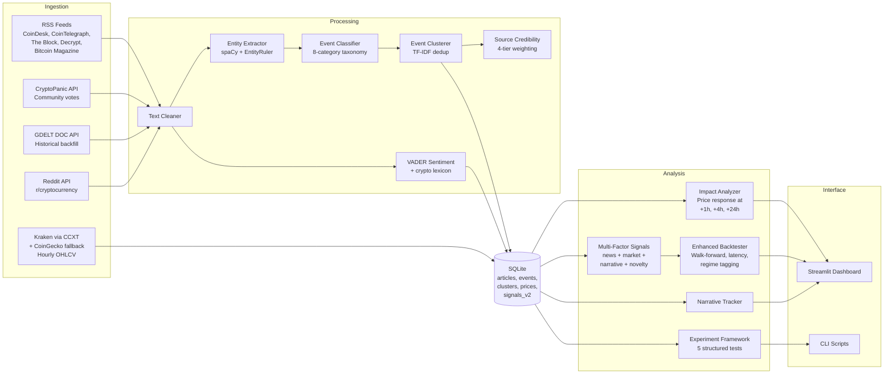

# Crypto News Research Engine

**A Python tool that ingests crypto news, classifies events, deduplicates them into canonical clusters, and runs statistical experiments to measure whether they create predictable price movements.**

---

## The Question

*Do specific types of crypto news events -- SEC lawsuits, exchange hacks, ETF approvals -- create tradeable price moves? Or is it all noise?*

This engine collects articles from 5+ sources (RSS feeds, GDELT, CryptoPanic), classifies them into an 8-category event taxonomy, deduplicates coverage into canonical event clusters, matches against historical price data from CoinGecko and CCXT/Kraken, and runs structured experiments with proper statistical tests. Then it backtests whether acting on those signals would have been profitable after transaction costs.

## Key Findings

*919 event clusters from 1,207 articles. 250 event-price pairs with hourly OHLCV data. All results from automated experiments with pre-registered methodology -- no cherry-picking.*

### 1. Narrative accumulation effect confirmed

Events covered by multiple news outlets produce significantly larger price moves than single-source events.

| Window | Multi-Article |Move| | Single-Article |Move| | Difference | p-value |
|--------|--------------------------|---------------------------|------------|---------|
| 1h     | 0.70%                    | 0.41%                     | +72%       | 0.030   |
| 4h     | 0.80%                    | 0.80%                     | ~0%        | 0.385   |
| 24h    | 2.24%                    | 1.95%                     | +15%       | 0.038   |

35 multi-article clusters vs 215 single-article events. Mann-Whitney U test (non-parametric). The effect is strongest in the first hour -- when an event hits multiple outlets simultaneously, the initial price impact is 72% larger.

### 2. Contrarian sentiment signal

Articles classified as SENTIMENT (hype, FUD, meme coins, influencer takes) predict *negative* 4h returns, consistent with a contrarian indicator.

| Category  | Window | Event Avg Return | Random Baseline | Difference | p-value  | N   |
|-----------|--------|------------------|-----------------|------------|----------|-----|
| SENTIMENT | 4h     | -0.27%           | +0.05%          | -0.32%     | 0.0004   | 135 |
| PROTOCOL  | 1h     | -0.48%           | -0.01%          | -0.47%     | 0.034    | 8   |

These are the only 2 statistically significant results out of 21 category-window combinations tested (Mann-Whitney U vs random time windows of equal duration). The SENTIMENT finding is robust (n=135, p=0.0004). PROTOCOL is directional but underpowered (n=8).

### 3. Signal decay is gradual

Most of the price impact does *not* happen instantly. With a 15-minute execution latency, you can still capture a significant portion of the move.

| Time Bucket | Avg Fraction of 24h Move | Median Fraction | N   |
|-------------|--------------------------|-----------------|-----|
| 0-1h        | 42%                      | 25%             | 248 |
| 1h-4h       | 57%                      | 45%             | 248 |
| 4h-24h      | 89%                      | 81%             | 248 |

Median 25% of the 24h move occurs in the first hour. 75% of the price impact is still ahead of you after hour one. This means the edge is accessible without low-latency infrastructure.

### 4. VADER sentiment alone does not predict returns

Spearman rank correlation between VADER compound sentiment score and 4h return: r=0.054, p=0.39 (n=250). Not significant. Event *classification* (which category the news falls into) outperforms raw sentiment scoring as a signal.

### 5. Most event categories show no significant price impact

Only 2 of 21 category-window combinations reached statistical significance (p < 0.05). 19 of 21 tests showed no difference from random. This is consistent with semi-efficient market expectations and should calibrate confidence in any news-based trading strategy.

| Category         | 1h p-value | 4h p-value | 24h p-value | Any Significant? |
|------------------|------------|------------|-------------|------------------|
| ADOPTION (n=43)  | 0.773      | 0.135      | 0.834       | No               |
| EXCHANGE (n=7)   | 0.069      | 0.237      | 0.891       | No               |
| MACRO (n=37)     | 0.275      | 0.435      | 0.820       | No               |
| MARKET_STR (n=7) | 0.759      | 0.191      | 0.843       | No               |
| PROTOCOL (n=8)   | **0.034**  | 0.306      | 0.565       | **Yes (1h)**     |
| REGULATORY (n=11)| 0.777      | 0.256      | 0.594       | No               |
| SECURITY (n=2)   | --         | --         | --          | Insufficient N   |
| SENTIMENT (n=135)| 0.438      | **0.0004** | 0.340       | **Yes (4h)**     |

### Methodology

All experiments use the same framework (see `scripts/experiment.py`):

- **Statistical test**: Mann-Whitney U (non-parametric, handles non-normal crypto returns)
- **Baseline**: Random time windows of equal duration from the same price data
- **Random seed**: Fixed at 42 for reproducibility
- **Event source**: Deduplicated event clusters (not raw articles -- avoids double-counting)
- **Cost model**: 0.30% round-trip (0.10% fee/side + 0.05% spread + 0.05% slippage)
- **Latency buffer**: 15 minutes between event detection and simulated entry
- **Sentiment extraction**: VADER with crypto-specific lexicon adjustments

Run the experiments yourself:
```bash
python scripts/experiment.py --run all --report --format md --output results.md
```

> **Note on reproducibility:** the SQLite database (`data/`) is gitignored, so a
> fresh clone starts empty — `experiment.py` will report `n_windows=0` until you
> ingest data first (`python scripts/ingest.py`, needs an internet connection and
> some time). The headline numbers above come from the author's populated DB; they
> reproduce only after ingestion, not on a clean checkout.

## Architecture



## Event Taxonomy

Every article is classified into one of 8 categories:

| Category | What it captures | Expected direction | Experimental result |
|---|---|---|---|
| **REGULATORY** | SEC actions, legislation, bans | Bearish | Not significant (n=11) |
| **EXCHANGE** | Listings, delistings, hacks | Depends | Borderline at 1h (p=0.069, n=7) |
| **PROTOCOL** | Upgrades, forks, governance | Bullish | **Significant at 1h (p=0.034, n=8)** |
| **MACRO** | Fed rates, inflation, geopolitics | Bearish | Not significant (n=37) |
| **ADOPTION** | ETF flows, institutional buys | Bullish | Not significant (n=43) |
| **SENTIMENT** | Hype, FUD, meme coins | Neutral | **Significant at 4h (p=0.0004, n=135)** |
| **SECURITY** | Hacks, exploits, rug pulls | Bearish | Insufficient data (n=2) |
| **MARKET_STRUCTURE** | Liquidations, whale moves | Depends | Not significant (n=7) |

## Setup

### Prerequisites

- Python 3.10 or newer
- ~500MB disk space (for dependencies + spaCy model + data)
- Internet connection for data ingestion (analysis works offline)

### Installation

```bash
# Clone and set up
git clone https://github.com/YOUR_USERNAME/news-crypto-engine.git
cd news-crypto-engine
python3 -m venv venv
source venv/bin/activate

# Install dependencies
pip install -e ".[dev]"
python -m spacy download en_core_web_sm
```

### Optional API Keys

```bash
# CryptoPanic (free tier, 5 req/min)
export CRYPTOPANIC_API_TOKEN="your_token"

# Reddit (free, requires app registration)
export REDDIT_CLIENT_ID="your_client_id"
export REDDIT_CLIENT_SECRET="your_client_secret"
```

## Usage

### Quick Start

```bash
# Collect articles + prices
python scripts/ingest.py --rss-only
python scripts/ingest.py --ccxt --days 30

# Process and cluster
python scripts/process.py

# Run experiments
python scripts/experiment.py --run all --report

# Launch dashboard
streamlit run src/dashboard/app.py
```

### Historical Backfill

```bash
# Backfill 90 days of news from GDELT
python scripts/ingest.py --gdelt --days 90

# Backfill exchange price data
python scripts/ingest.py --ccxt --days 30

# Process and cluster everything
python scripts/process.py
python scripts/process.py --cluster-only

# Run full experiment suite
python scripts/experiment.py --run all --report --format md --output results.md
```

### CLI Reference

```bash
# Ingestion
python scripts/ingest.py                    # Run all collectors once
python scripts/ingest.py --rss-only         # RSS feeds only
python scripts/ingest.py --ccxt             # Exchange prices via CCXT/Kraken
python scripts/ingest.py --cryptopanic      # CryptoPanic API
python scripts/ingest.py --gdelt --days 90  # GDELT historical backfill
python scripts/ingest.py --prices-only      # CoinGecko prices (fallback)
python scripts/ingest.py --discover         # Auto-discover new assets
python scripts/ingest.py --stats            # Database statistics

# Processing
python scripts/process.py                   # Process + cluster new articles
python scripts/process.py --cluster-only    # Re-run clustering only
python scripts/process.py --reprocess       # Re-classify everything

# Analysis
python scripts/analyze.py                   # Impact analysis report
python scripts/analyze.py --signals-v2      # Generate multi-factor signals
python scripts/analyze.py --narratives      # Narrative tracker

# Experiments
python scripts/experiment.py --run all      # All 5 experiments
python scripts/experiment.py --run 1        # Specific experiment (1-5)
python scripts/experiment.py --report --format md --output results.md
```

### Experiments

| # | Name | Tests |
|---|------|-------|
| 1 | Event-Return Correlation | Per-category avg return vs random baseline (Mann-Whitney U) |
| 2 | Sentiment-Return Correlation | VADER score vs subsequent return (Spearman rank) |
| 3 | Narrative Accumulation | Multi-article clusters vs single-article moves |
| 4 | Signal Decay Analysis | When does the price move happen? (0-1h / 1-4h / 4-24h) |
| 5 | Walk-Forward Validation | In-sample vs out-of-sample Sharpe ratio |

## Tech Stack

| Tool | Why |
|---|---|
| **SQLite** | Zero-config embedded database. Single file, works offline. |
| **scikit-learn** | TF-IDF vectorization for event deduplication/clustering. |
| **CCXT** | Exchange-native OHLCV data from Kraken (no API key needed). |
| **spaCy** (sm model) | Fast NLP with custom entity patterns via EntityRuler. |
| **VADER** (NLTK) | Lexicon-based sentiment, fast and interpretable. |
| **scipy** | Mann-Whitney U and Spearman tests for experiment framework. |
| **Streamlit** | Python-to-dashboard with zero frontend code. |
| **feedparser** | Battle-tested RSS parser. |

Deliberately excluded: TensorFlow, PyTorch, Docker, PostgreSQL, Redis, Celery. This runs on a laptop.

## Project Structure

```
news-crypto-engine/
├── config.yaml                 # All settings (sources, clustering, signals, costs)
├── src/
│   ├── ingestion/              # RSS, CryptoPanic, GDELT, CCXT, CoinGecko, Reddit
│   ├── processing/             # Text cleaning, NER, classification, sentiment,
│   │                           #   event clustering, source credibility
│   ├── analysis/               # Impact measurement, multi-factor signals,
│   │                           #   enhanced backtester, experiment framework
│   ├── storage/                # SQLite schema and CRUD
│   └── dashboard/              # Streamlit app
├── scripts/                    # CLI: ingest, process, analyze, experiment, backtest
├── tests/                      # 166 tests (pytest)
└── data/                       # SQLite DB + logs (gitignored)
```

## Testing

```bash
python -m pytest tests/ -v
```

166 tests covering:
- Database CRUD, schema integrity, extended queries
- Text cleaning, event classification (all 8 categories)
- Sentiment analysis with crypto lexicon
- **Event clustering**: similar articles merge, dissimilar stay separate, time window enforcement, severity/headline/asset aggregation, idempotency
- **Source credibility**: tier lookup, case-insensitive matching, unknown source fallback
- **Novelty decay**: exponential math, update mechanism
- **Market confirmation**: volume z-score, momentum alignment, ATR/regime, confirmation scoring
- **Multi-factor signals**: weighted scoring, confirmation gate, news component bounds, persistence
- **Enhanced backtester**: latency buffer, cost model, position sizing (fixed/confidence/Kelly), regime tagging, walk-forward validation
- **Experiment framework**: all 5 experiments produce valid results, report generation (text + markdown), random baseline reproducibility
- **Data sources**: CryptoPanic deduplication and vote capture, CCXT symbol mapping, GDELT date parsing, asset auto-discovery

## Limitations

- **Small sample sizes.** Many event categories have n < 20, limiting statistical power. The SENTIMENT finding (n=135) is the most robust; others need more data to confirm.
- **No Bonferroni correction.** 21 simultaneous tests at p < 0.05 means ~1 false positive expected by chance. The SENTIMENT result (p=0.0004) survives Bonferroni; PROTOCOL (p=0.034) does not.
- **Classifier is rule-based.** Keyword matching is fast and interpretable but will misclassify edge cases. Supports swapping in an ML classifier.
- **No live trading.** Research tool only. The backtester simulates entries/exits but has no broker integration.
- **VADER sentiment is limited.** Fine-tuned transformer models would be more accurate but require GPU.
- **Walk-forward inconclusive.** Only 1 walk-forward window possible with current data span. Need 2-3 months of continuous collection for meaningful validation.

## License

MIT -- see [LICENSE](LICENSE).
